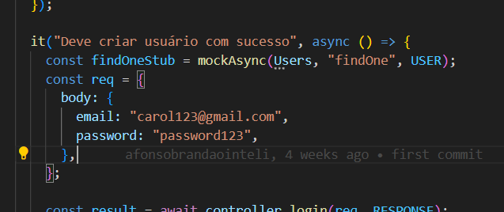

# Prova

## Alterações feitas

### Instalar dependencias:

Primeiro rodei o comando `npm i` para instalar todas as dependencias:

Depois rodei o `npm test` para testar a aplicação:

### UserController.js

Arrumei o UserController.js de

` await Users.novo({ ...req.body, id: "sas", profile_photo: url });`

para 

`await Users.create({ ...req.body, id: "sas", profile_photo: url });`

### user.test.js

- E adicionei o email como body no arquivo user.test.js:

- Alem disso adicionei a seguinte linha:
`const uploadStub = mockAsync(sails.helpers, "upload", "url");`

 - Rodei novamente:

## ACT
- Corrigi o erro no ci.yml:

- E rodei no terminal:

# petbook-aula

a [Sails v1](https://sailsjs.com) application

### Links

+ [Sails framework documentation](https://sailsjs.com/get-started)
+ [Version notes / upgrading](https://sailsjs.com/documentation/upgrading)
+ [Deployment tips](https://sailsjs.com/documentation/concepts/deployment)
+ [Community support options](https://sailsjs.com/support)
+ [Professional / enterprise options](https://sailsjs.com/enterprise)

### Version info

This app was originally generated on Fri May 10 2024 18:44:02 GMT-0300 (Horário Padrão de Brasília) using Sails v1.5.9.

<!-- Internally, Sails used [`sails-generate@2.0.10`](https://github.com/balderdashy/sails-generate/tree/v2.0.10/lib/core-generators/new). -->

<!--
Note:  Generators are usually run using the globally-installed `sails` CLI (command-line interface).  This CLI version is _environment-specific_ rather than app-specific, thus over time, as a project's dependencies are upgraded or the project is worked on by different developers on different computers using different versions of Node.js, the Sails dependency in its package.json file may differ from the globally-installed Sails CLI release it was originally generated with.  (Be sure to always check out the relevant [upgrading guides](https://sailsjs.com/upgrading) before upgrading the version of Sails used by your app.  If you're stuck, [get help here](https://sailsjs.com/support).)
-->

